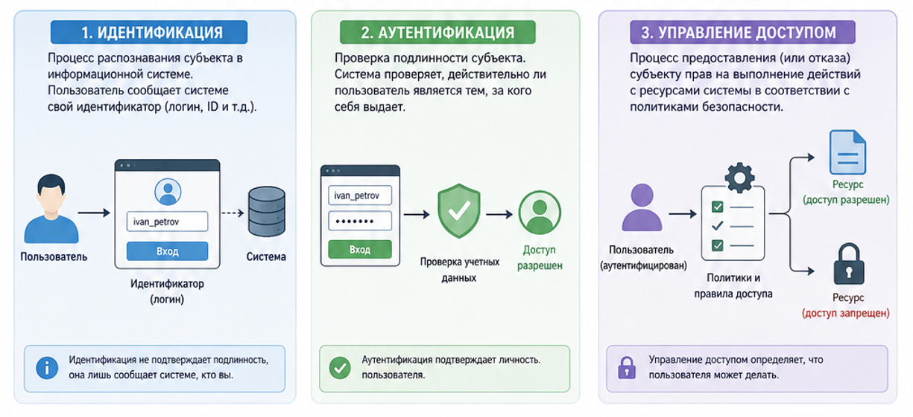
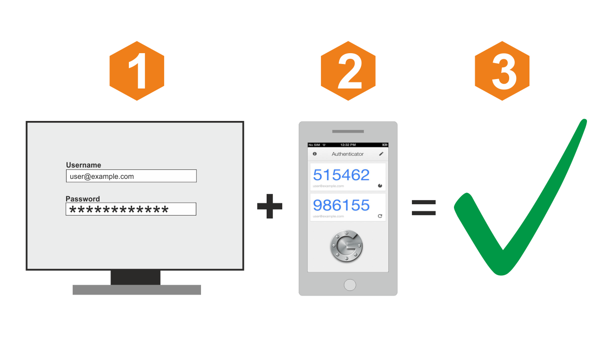

---
## Author
author:
  name: Симонова Полина Игоревна
  orcid: 0000-0002-0877-7063
  email: 1132246738@rudn.ru
  affiliation:
    - name: Российский университет дружбы народов
      country: Российская Федерация
      postal-code: 117198
      city: Москва
      address: ул. Миклухо-Маклая, д. 6

## Title
title: "Доклад на тему: Идентификация и аутентификация,управление доступом"
subtitle: "Основы информационной безопасности"
license: "CC BY"
---

# Цель работы

Изучить ключевые методы идентификации, аутентификации и методы управения доступом в современных системах информационной безопасности. Проанализировать и сравнить их механизмы, модели и современные стандарты.

# Задание

* Изучить механизмы аутентификации и идентификации, методы управления доступом, описать их теоретические основы;

* Рассмотреть способы их применения в современных компьютерных системах, выявить проблемы и риски;

* Сравнить рассмотренные механизмы и методы между собой.

# Теоретическое введение

Идентификация - это процесс, при котором субъект предоставляет системе уникальный идентификатор (например, логин, email, биометрию, номер телефона, id-токен), чтобы система могла его опознать. Аутентификация (подтверждение личности) следует за идентификацией и подтверждает подлинность субъекта с помощью факторов вроде пароля, пин-кода или sms-сообщения. Управление доступом определяет, какие операции разрешены аутентифицированным пользователям, обеспечивает принцип минимальных привилегий.

{#fig:001 width=100%}

#  Методы и механизмы идентификации и аутентификации

Методы идентификации включают использование уникальных идентификаторов: логины, удостоверения, смарт-карты или биометрические данные (отпечатки пальцев, распознавание лица). Идентификация работает по принципу сопоставления предоставленного идентификатора с базой данных системы: пользователь вводит логин или предъявляет токен, система ищет его в каталоге (LDAP, Active Directory) и возвращает профиль с ролями. Механизм включает хэширование идентификаторов для защиты и проверку уникальности, чтобы избежать коллизий; в распределенных системах (OAuth) используется discovery-эндпоинт для поиска метаданных.

Аутентификация классифицируется по факторам: «что знаешь» (пароль), «что имеешь» (токен), «кто ты» (биометрия), «где находишься» (геолокация).Аутентификация реализуется через вызовы протоколов: в парольной схеме пароль хэшируется (bcrypt, Argon2) и сравнивается с хранимым хэшем; при неудаче — блокировка аккаунта. Двухфакторная (2FA) добавляет второй этап — TOTP (HMAC-based one-time password по RFC 6238) или push-уведомление. Биометрия сканирует шаблон (минует изображение), сравнивает с хранимым вектором (minutiae для отпечатков) с порогом FAR/FRR <0.001%.

Наиболее надежны многофакторные схемы (MFA), где сочетаются 2+ фактора, как рекомендует NIST в SP 800-63B. Биометрия устойчива к краже, но уязвима к подделкам (спуфинг), поэтому часто комбинируется с криптографией.

{#fig:002 width=100%}

#  Управление доступом: сущность и задачи

Управление доступом — это процесс, который определяет, какие действия разрешены пользователю после успешной идентификации и аутентификации. Иначе говоря, система должна не только узнать пользователя, но и решить, что именно ему можно делать с ресурсами.

В задачи управления доступом входят назначение прав, контроль их использования, ограничение несанкционированных действий, журналирование и аудит. Это особенно важно в корпоративных сетях, государственных системах и облачных платформах, где количество пользователей и ресурсов постоянно растет.

#  Основные модели управления доступом

Существует несколько основных моделей управления доступом. 

* Дискреционное управление доступом, или DAC, предполагает, что права назначает владелец ресурса. Эта модель гибкая, но при большом числе пользователей может стать небезопасной.

* Мандатное управление доступом, или MAC, строится на строгих правилах и метках безопасности. Оно применяется там, где особенно важны конфиденциальность и жесткий контроль, например в государственных или военных системах.

* Ролевая модель, или RBAC, назначает права не каждому пользователю отдельно, а роли, которую он выполняет в организации. Это удобно в больших компаниях, потому что упрощает администрирование.

* В последние годы активно развивается модель ABAC, где решение о доступе принимается на основе атрибутов пользователя, устройства, времени, местоположения и других условий. Также исследуются гибридные модели RBAC/ABAC, которые сочетают удобство ролей и гибкость атрибутов.

: Сравнение моделей управления доступом

| Модель      | Описание                                      | Пример использования        | Особенности                     |
|-------------|-----------------------------------------------|-----------------------------|---------------------------------|
| DAC         | Владелец сам назначает доступ                 | Файлы в ОС                  | Гибкость                        |
| MAC         | Доступ по строгим правилам                    | Военные системы             | Высокая безопасность            |
| RBAC        | Доступ на основе ролей                        | Корпоративные системы       | Удобство управления             |
| ABAC        | Доступ по атрибутам (время, место и т.д.)     | Современные системы         | Гибкость и сложность            |

#  Современные подходы и стандарты

Современные IAM-системы централизуют управление с федеративной аутентификацией (OAuth 2.0, OpenID Connect, SAML) для единого входа (SSO). Модель Zero Trust (NIST SP 800-207) проверяет каждый запрос по контексту (устройство, поведение), актуальна для облаков вроде AWS IAM и Azure AD.

NIST SP 800-63 определяет уровни IAL (идентификация), AAL (аутентификация, MFA/FIDO2) и FAL (федерация), снижая риски фишинга. В IoT — JWT-токены, CoAP/DTLS, блокчейн-идентичность.

ISO 27001:2022 (Annex A.5/A.8) требует политики доступа, MFA, аудита и joiner-mover-leaver; дополнено GDPR и ISO 27018. В России ФСТЭК/ФСБ — ГОСТ-протоколы (GOST R 34.10) для ГИС.

#  Проблемы и риски 

Основные угрозы в этой области связаны с кражей паролей, подделкой учетных данных, перехватом сеансов, ошибками в настройке прав и чрезмерными привилегиями. Особенно опасны ситуации, когда учетная запись давно не используется, но все еще имеет высокие права доступа.
Еще одна проблема — человеческий фактор: пользователи часто выбирают слабые пароли, повторно используют их на разных сервисах или передают другим лицам. Поэтому эффективная защита требует не только технических средств, но и организационных мер: политики паролей, обучения персонала, аудита и регулярного пересмотра прав.

# Заключение 

Идентификация, аутентификация и управление доступом — это взаимосвязанные элементы единой системы защиты информации. Идентификация отвечает за распознавание субъекта, аутентификация подтверждает его личность, а управление доступом определяет пределы его полномочий.

Наиболее эффективными сегодня считаются многофакторная аутентификация, централизованное IAM-управление и гибкие модели доступа. Именно сочетание технических, организационных и нормативных мер позволяет обеспечить надежную защиту информационных ресурсов.

# Выводы

Я изучила механизмы, модели и стандарты для идентификации и аутентификации, рассмотрела методы управления доступом, а также выявила возможные проблемы и риски.

# Список литературы

1. Волхонский В. В. Системы контроля и управления доступом : учеб. пособие / В. В. Волхонский. – Санкт-Петербург : [б. и.], 2015. – .

2. Таненбаум Э. Современные операционные системы / Э. Таненбаум. 

3. Идентификация, аутентификация, авторизация: чем они различаются? [Электронный ресурс] // Яндекс Практикум. – URL: https://practicum.yandex.ru/blog/identifikatsiya-autentifikatsiya-avtorizatsiya-chem-oni-razlichayutsya/ (дата обращения: 01.05.2026). –.

4. Идентификация, аутентификация и авторизация: в чем разница? [Электронный ресурс] // Habr. – URL: https://habr.com/ru/companies/otus/articles/726846/ (дата обращения: 01.05.2026). –.

5. Digital Identity Guidelines: Authentication and Lifecycle Management : NIST Special Publication 800-63B / National Institute of Standards and Technology (NIST). – Gaithersburg, MD : U.S. Department of Commerce, 2020. – URL: https://cyberreadinessinstitute.org/wp-content/uploads/NIST-Special-Publication-800-63B.pdf (дата обращения: 01.05.2026).
